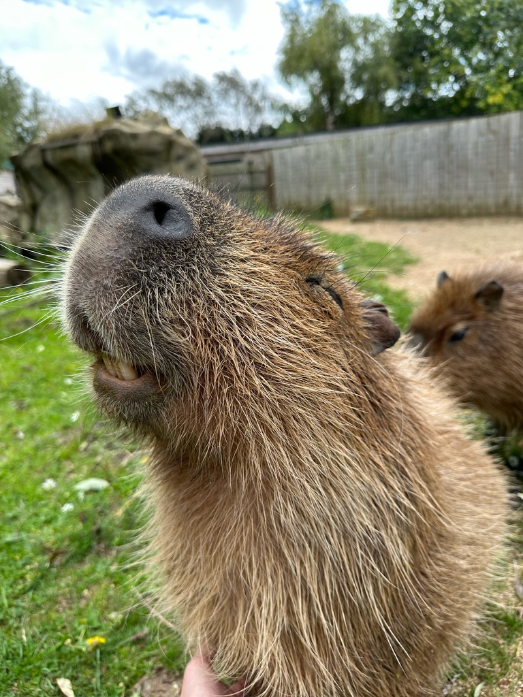

# CapyVerse

## This Repo
This repo is a collection of personal projects, 
experiments, and prototypes — mostly in **Python** 
and **R**, with a mix of finance, data science, and random 
curiosities. Inspired by the most beautiful animal on the
planet, tha capybara.

  

## Shared Functions

Functions that are used across multilple projects are stored in the shared 
directory, this includes CaPy (for python functions) and CapybaRa (R functions).

## Credentials

The projects in this repository use several APIs to get data, some
of which require credentials to be parsed. All credentials should be
saved in the Credentials directory. Please use the example .ini files
to set up your own credentials to these APIs, when you have entered
your own credentials please remove the '-example' from the name of 
the .ini file. These are in the .gitignore so should not make it to
the repository.

## Disclaimer

This is a personal project. It is **not affiliated with, endorsed by, 
or produced on behalf of my current or any former employer**.
I have **not used any confidential or proprietary information** from my
employer. No licensed or restricted data (e.g., Bloomberg/ Refinitiv 
Datastream/ internal systems) is used here. Data used is public/open
or self-generated and is cited where applicable.
**No investment advice.** Content is for educational/experimental 
purposes only and does not constitute financial advice, research, 
or a solicitation to buy/sell any security.
Opinions expressed are **my own** and do not represent those of my employer.
